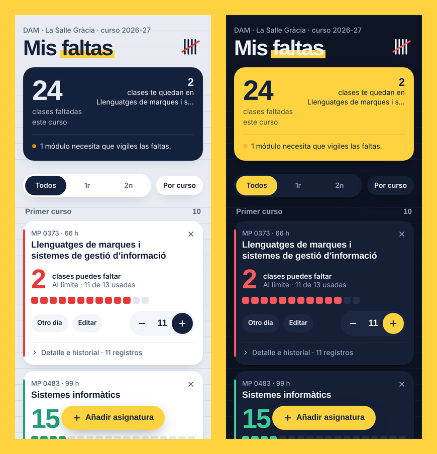

<div align="center">


# 📒 Mis faltas

**Apunta tus faltas en cada módulo de DAM y mira cuántas clases te quedan antes de perder la evaluación continua.**

### 👉 [faltas-dam.vercel.app](https://faltas-dam.vercel.app) 👈



</div>

---

## ¿Para qué sirve?

A final de curso nadie se acuerda de cuántas veces ha faltado a cada asignatura. Con esta web lo apuntas en un toque y siempre sabes cuánto margen te queda en cada módulo.

## Qué hace

| | |
|---|---|
| 📚 **Los 18 módulos de DAM ya cargados** | Con las horas en el centro del PIC 2026-27 (sin horas en empresa), clases de 1 h y límite del 20 %. |
| ➕ **Apuntar en un toque** | El botón **+** apunta una falta con la fecha de hoy. **Otro día** sirve para faltas pasadas, varias clases o añadir una nota. |
| 🟩 **Cuadritos de faltas** | Cada módulo muestra una casilla por cada clase que puedes faltar. Se van rellenando y cambian de color: verde, naranja y rojo. |
| 📊 **Resumen arriba** | Total de clases faltadas, el módulo más ajustado y aviso si alguno está en riesgo. |
| 🔎 **Filtros** | Todos / 1r / 2n, y ordenar por curso o por riesgo. |
| ↩️ **Deshacer** | Si quitas un módulo o borras una falta por error, lo recuperas con un toque. |
| 💾 **Copia de seguridad** | Exporta e importa tus datos para pasarlos a otro móvil. |
| 🌗 **Modo claro y oscuro** | Se adapta solo al ajuste de tu móvil. |

## Tus datos

Todo se guarda **en tu propio navegador**. No hay cuentas ni servidor: nadie más ve tus faltas.

- Recargar la página o cerrarla **no borra nada**.
- Se pierden si borras los datos del navegador, usas modo incógnito o cambias de móvil. Para eso está **Exportar copia**.

> 💡 **Consejo:** en el móvil, abre la web y dale a *Añadir a pantalla de inicio* para tenerla como una app.

## Cómo se calcula

```
faltas permitidas (h)  = horas del módulo × límite %
clases que puedes faltar = faltas permitidas ÷ horas por clase   (redondeado hacia abajo)
```

Ejemplo: **Programació**, 198 h × 20 % = 39,6 h → **39 clases** de 1 h.

Si tu módulo tiene otras horas o otro límite, toca **Editar** en su tarjeta.

> ⚠️ Cálculo orientativo. Confirma siempre el límite de cada módulo con tu tutor o en la programación.

## Hecho con

Un solo `index.html`: HTML, CSS y JavaScript sin librerías ni dependencias. Para ejecutarlo en local basta con abrir el archivo en el navegador.

---

<div align="center">

Hecho por **Alfonso Ibáñez** para la clase de DAM de La Salle Gràcia.<br>
¿Algo no cuadra? Abre un *issue* o díselo en clase.

</div>
